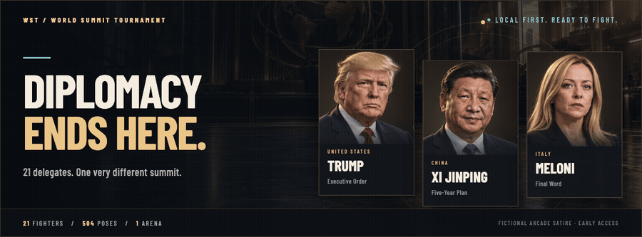
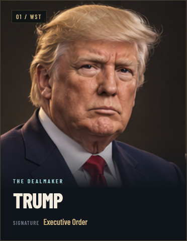
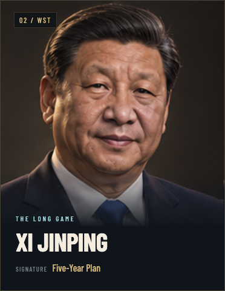
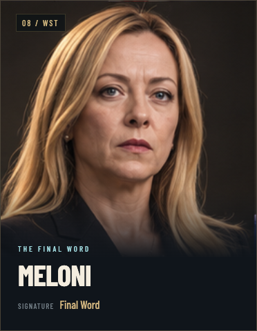
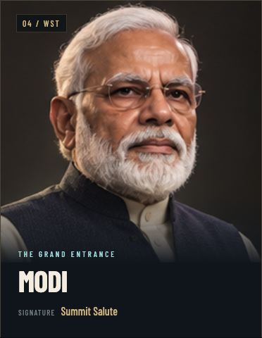
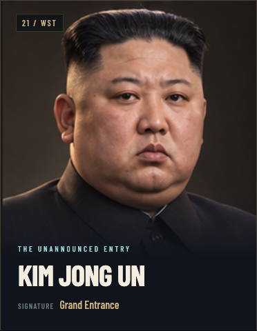

<p align="center">
  <a href="https://cristianexer.github.io/WST/">
    
  </a>
</p>

<h1 align="center">World Summit Tournament</h1>

<p align="center">
  <strong>No speeches. Just combos.</strong><br>
  A fictional arcade showdown with 21 delegates, signature moves, and an AI opponent running in your browser.
</p>

<p align="center">
  <a href="https://cristianexer.github.io/WST/"><strong>▶ PLAY NOW</strong></a>
  &nbsp; · &nbsp;
  <a href="#quick-start">Run locally</a>
  &nbsp; · &nbsp;
  <a href="#controls">Controls</a>
  &nbsp; · &nbsp;
  <a href="docs/LAYA_BROWSER.md">Inside the AI</a>
</p>

<p align="center">
  
  
  
  
</p>

<p align="center">
  <a href="https://cristianexer.github.io/WST/">
    
  </a>
</p>

## The summit has a new agenda

Pick your fighter. Pick your opponent. Settle it in a best-of-three, 60-second showdown.

| Bring to the arena | What you get |
| :--- | :--- |
| **A fighter with personality** | 21 delegates with detailed generated artwork, fictional quips and distinct stat trade-offs. |
| **Your own signature** | One fixed special per character, with its own mechanics, release animation and sound. |
| **Room to move** | Responsive footwork, running jumps, air steering, throws, parries and combos. A dedicated worker runs combat at 60 Hz. |
| **An opponent that reacts** | A local combat controller reads delayed public state; experimental Laya advice runs independently on WebGPU. |
| **A proper fight soundtrack** | Recorded guitar rock, impact and movement foley, separate music volume, and a **Your Track** local-file player. |
| **The rematch receipts** | Training, AI Cam, deterministic replays and up to 60-second video clips. |

## Meet a few of the delegates

Six faces from a 21-person roster. Every fighter has **24 rendered poses** and a signature that belongs to them.

<table>
  <tr>
    <td width="33%"></td>
    <td width="33%"></td>
    <td width="33%"></td>
  </tr>
  <tr>
    <td></td>
    <td></td>
    <td></td>
  </tr>
</table>

**Power · Speed · Vitality · Stamina · Recovery**

Each build spends the same 500-point stat budget, with real differences in damage, movement and resources. Power trades off against vitality. Balance is still evolving; the [matchup audit](docs/VERIFICATION.md#roster-and-balance) records the current results and limitations.

<details>
<summary><strong>Explore the full 21-fighter roster</strong></summary>

| Americas | Europe | Asia & Pacific | Middle East & Africa |
| :--- | :--- | :--- | :--- |
| Donald Trump | Andy Burnham | Xi Jinping | Mohammed bin Salman |
| Luiz Inácio Lula da Silva | Emmanuel Macron | Narendra Modi | Recep Tayyip Erdoğan |
| Mark Carney | Friedrich Merz | Sanae Takaichi | Cyril Ramaphosa |
| Claudia Sheinbaum | Giorgia Meloni | Lee Jae Myung | |
| Javier Milei | Vladimir Putin | Prabowo Subianto | |
| | Ursula von der Leyen | Anthony Albanese | |
| | | Kim Jong Un | |

Player and AI selections are independent. Mirror matches are supported. The cast and role labels follow the project's fictional tournament brief, not a verified directory of current officeholders.

</details>

## Quick start

**Play instantly:** [cristianexer.github.io/WST](https://cristianexer.github.io/WST/)

Or run it on your machine with Node.js 22:

```sh
git clone https://github.com/cristianexer/WST.git
cd WST
npm ci
npm run dev
```

Open the URL printed by Vite. No account, API key or inference server is required. The repository includes the model and artwork, so the initial clone is substantial.

| Start mode | What happens |
| :--- | :--- |
| **Enter baseline practice** | Start with the local combat controller. No model download or WebGPU inference required. |
| **Initialize hybrid Laya** | Accept the GPU notice, download about **413 MB** of model data, then wait for verification and a real warm-up decision. Requires WebGPU and substantial memory. |

Both modes use WebGL 2 for the arena. Laya runs in its own worker; its recovery path keeps combat active if inference stalls. There is no WASM inference fallback for the shipped graph. [Browser requirements and measurements →](docs/LAYA_BROWSER.md)

## Controls

| Move | Key | Move | Key |
| :--- | :---: | :--- | :---: |
| Move left / right | **A / D** | Light / heavy | **J / K** |
| Jump / crouch | **W / S** | Guard | **Space** |
| Dash | **L** | Throw / break | **U** |
| Parry | **I** | Signature | **O** |
| Pause | **Esc** | AI Cam | **C** |

**Mix it up:** down + J → body strike · down + K → low · forward + J → anti-air · forward + K → overhead. J or K in the air performs an air kick.

Land strikes to charge your signature; eight clean hits fill the meter. Key bindings are configurable, gamepads are supported, and touch controls are experimental.

## Inside the opponent

**Laya + combat is an explicit hybrid.** A local controller reacts to delayed public match state up to 15 times per simulation second. The genuine Laya model independently proposes tactics; each proposal is checked against the current situation before it can execute.

AI Cam shows the recommendation, the action actually chosen, its source, latency and public context. Neither layer reads your keyboard or hidden future state. The general Laya checkpoint is **not trained for this fighting game** and can propose passive choices; the local controller keeps the opponent active between inferences.

[Model provenance and export parity](docs/LAYA_BROWSER.md) · [Combat verification](docs/VERIFICATION.md) · [Implementation contract](docs/IMPLEMENTATION_CONTRACT.md)

## Built for the browser

**React 19 + TypeScript · Three.js · Web Workers · ONNX Runtime Web · Web Audio · Vite**

```text
apps/web/src/
  ai/                  Laya worker, public-state adapter and combat director
  audio/               Impact foley, signature cues and arena radio
  components/          Menus, fighter selection, HUD and match flow
  game/                Combat worker, controls, rendering and replays
apps/web/public/
  assets/              Generated artwork, arena and WST identity
  audio/               Recorded foley and licensed rock tracks
  models/laya/         Pinned model, tokenizer and integrity manifest
packages/
  combat-core/src/     Deterministic simulation, moves and fighter stats
  content/src/         Roster and original fictional flavour text
tests/                 Combat, input, AI, rendering and audio checks
tools/                 Model conversion, balance audit and local deployment
docs/                  Technical notes, source brief and asset provenance
```

<details>
<summary><strong>Development, replays and deployment</strong></summary>

```sh
npm test              # Run the regression suite
npm run build         # Type-check and generate dist/
npm run preview       # Serve the production build locally
npm run deploy:pages  # Test, build locally and publish dist to gh-pages
```

Source lives on **main**; the prebuilt website lives on **gh-pages** with `.nojekyll`. GitHub Pages serves the branch root. Builds run locally; GitHub still performs its managed Pages deployment step. Relative asset URLs support the `/WST/` project path.

The full model is split into integrity-checked chunks for static hosting. The complete site is approximately 640 MiB. Exact runtime limitations and pinned versions are in [the Laya notes](docs/LAYA_BROWSER.md).

Replay format **v5** records every applied worker input and reconstructs both selected fighter profiles. The last five completed matches stay in local storage; replay playback makes no AI calls. Video capture depends on MediaRecorder support and includes game effects, not the separate radio track.

The lockfile pins dependencies. `.npmrc` enables the legacy peer resolver to avoid a resolver issue in this toolchain.

</details>

## Credits & creative notes

- **Character art:** 504 generated poses across 63 sheets, presented as animated **2.5D sprites**. [Artwork provenance](docs/ASSETS.md)
- **WST identity:** original generated logo, favicon and social mark. [Brand notes](docs/BRAND.md)
- **Sound:** Kenney CC0 foley plus original signature cues. **Radio:** Kevin MacLeod's *Big Rock*, *Cool Rock* and *Hotrock*, CC BY 4.0. [Sources and licences](docs/AUDIO.md)
- **Laya:** pinned `convaiinnovations/laya` checkpoint, with its upstream Apache-2.0 licence and conversion notice included. [Runtime details](docs/LAYA_BROWSER.md)

All dialogue and quips are original game fiction. Stats describe arcade builds, not political ability. The game contains no real speeches or cloned voices.

---

<p align="center">
  <strong>THE NEXT ROUND OF NEGOTIATIONS IS PERSONAL.</strong><br><br>
  <a href="https://cristianexer.github.io/WST/"><strong>ENTER THE ARENA →</strong></a><br><br>
  <sub>WST · Fictional arcade satire · Early access</sub>
</p>
